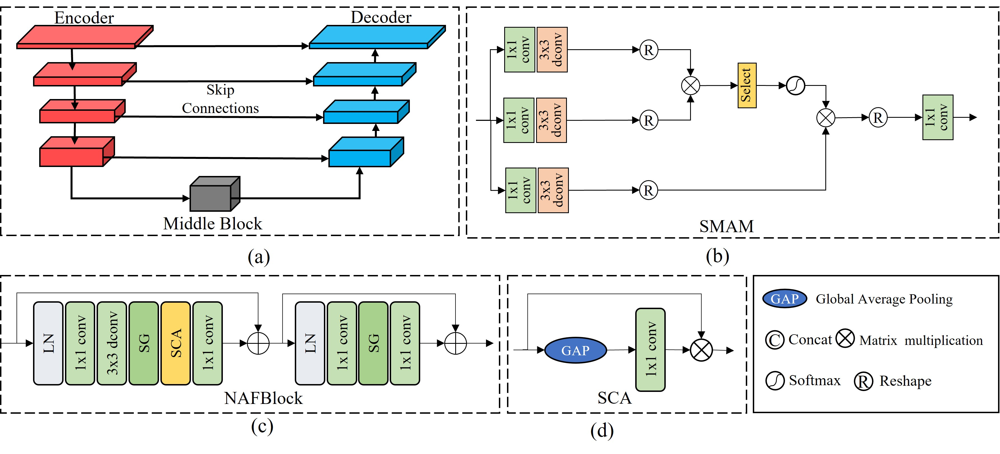
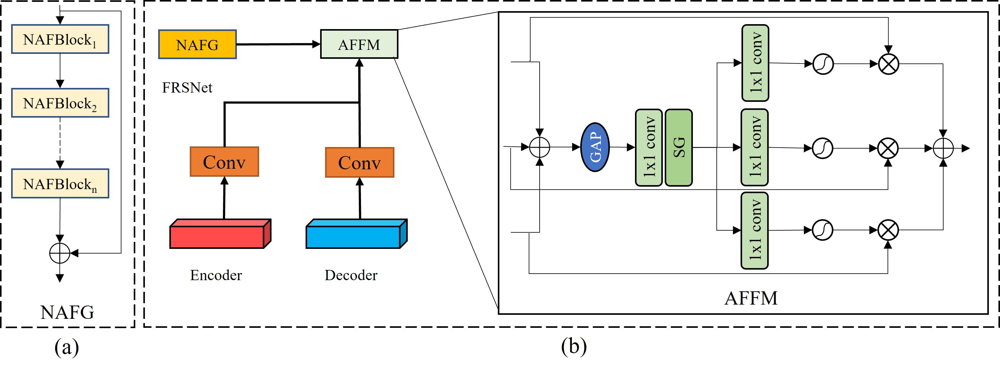
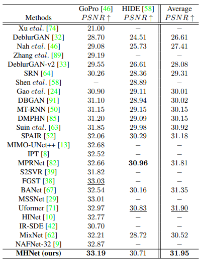
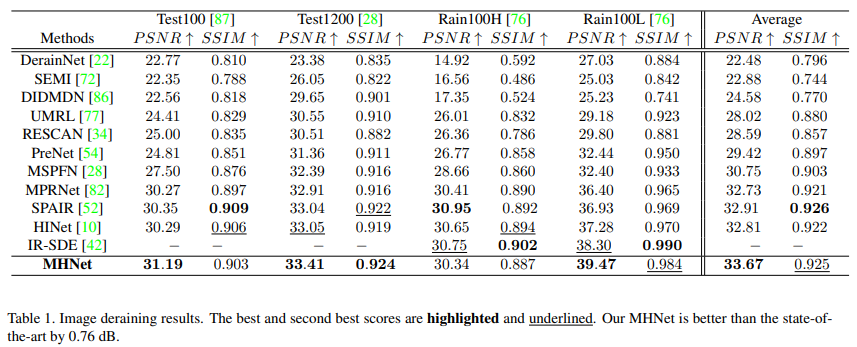

# Mixed Hierarchy Network for Image Restoration

[](http://arxiv.org/abs/2302.09554)
	
	

	


<hr />


> **Abstract:** Image restoration is a long-standing low-level vision problem, e.g., deblurring and deraining. In the process of image restoration, it is necessary to consider not only the spatial details and contextual information of restoration to ensure the quality but also the system complexity. Although many methods have been able to guarantee the quality of image restoration, the system complexity of the state-of-the-art (SOTA) methods is increasing as well. Motivated by this, we present a mixed hierarchy network that can balance these competing goals. Our main proposal is a mixed hierarchy architecture, that progressively recovers contextual information and spatial details from degraded images while we use simple blocks to reduce system complexity.  Specifically, our model first learns the contextual information at the lower hierarchy using encoder-decoder architectures, and then at the higher hierarchy operates on full-resolution to retain spatial detail information.  Incorporating information exchange between different hierarchies is a crucial aspect of our mixed hierarchy architecture. To achieve this, we design an adaptive feature fusion mechanism that selectively aggregates spatially-precise details and rich contextual information. In addition, we propose a  selective multi-head attention mechanism  with linear time complexity as the middle block of the encoder-decoder to adaptively retain the most crucial attention scores.  What's more, we use the nonlinear activation free block as our base block to reduce the system complexity. The resulting tightly interlinked hierarchy architecture, named as MHNet, delivers strong performance gains on several image restoration tasks, including image deraining, and deblurring. 
## Network Architecture

<table>
  <tr>
    <td align="center">  </td>
  </tr>
  <tr>
    <td><p align="center"><b>Overall Framework of MHNet</b></p></td>
  </tr>
    <tr>
    <td align="center">  </td>
  </tr>
  <tr>
    <td><p align="center"><b>(a) Encoder-decoder subnetwork. (b) Selective multi-head attention mechanism (SMAM) (c) The architecture of nonlinear activation free block (NAFBlock). (d) Simplified Channel Attention (SCA).</b></p></td>
    </tr>
<tr>
    <td align="center">  </td>
  </tr>
  <tr>
    <td><p align="center"><b>(a) The  architecture of nonlinear activation free block groups (NAFG). Each NAFG further contains multiple nonlinear activation free blocks (NAFBlocks). (b) Adaptive feature fusion mechanism (AFFM) between an encoder-decoder subnetwork and FRSNet.</b></p></td>
    </tr>
</table>


## Installation
The model is built in PyTorch 1.1.0 and tested on Ubuntu 16.04 environment (Python3.7, CUDA9.0, cuDNN7.5).

For installing, follow these intructions
```
conda create -n pytorch1 python=3.7
conda activate pytorch1
conda install pytorch=1.1 torchvision=0.3 cudatoolkit=9.0 -c pytorch
pip install matplotlib scikit-image opencv-python yacs joblib natsort h5py tqdm
```

Install warmup scheduler

```
cd pytorch-gradual-warmup-lr; python setup.py install; cd ..
```


## Training and Evaluation

Training and Testing codes for deblurring and deraining  are provided in their respective directories.

<!--## Results


<details>
  <summary> <strong>Image Deblurring</strong> (click to expand) </summary>
<table>
  <tr>
    <td>  </td>
  </tr>
  <tr>
    <td><p align="center"><b>Deblurring on GoPro and HIDE Datasets.</b></p></td>
  </tr>
</table></details>

<details>
  <summary> <strong>Image Deraining</strong> (click to expand) </summary>
</details>
-->
## Visualization Results
### Download the [Derain](https://drive.google.com/drive/folders/1WVolv5xPXZyK820KCYTbv52RNAjunbd0?usp=share_link)
### Download the [Deblur](https://drive.google.com/drive/folders/1S9d4xgGu8wBGhQzylP8Xlu-DHngSgVR9?usp=sharing)


 ## Citations
If our code helps your research or work, please consider citing our paper.
The following is a BibTeX reference:

```
@article{gao2023mixed,
  title={Mixed Hierarchy Network for Image Restoration},
  author={Gao, Hu and Dang, Depeng},
  journal={arXiv preprint arXiv:2302.09554},
  year={2023}
}


```


## Contact
Should you have any question, please contact two_bits@163.com

