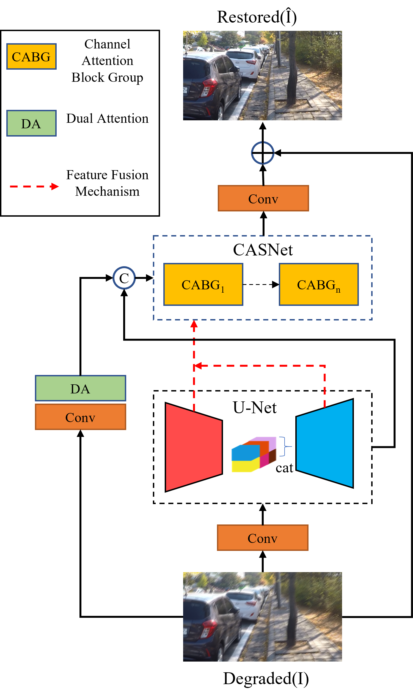

# Mixed Hierarchy Network for Image Restoration


<hr />


> **Abstract:** * Image restoration is a long-standing low-level vision problem, e.g., deblurring and deraining. In the process of image restoration, it is necessary to consider not only the spatial details and contextual information of restoration to ensure the quality, but also the system complexity. Although many methods have been able to guarantee the quality of image restoration, the system complexity of the state-of-the-art (SOTA) methods is increasing as well. Motivated by this, we present a mixed hierarchy network that can balance these competing goals. Our main proposal is a mixed hierarchy architecture, that progressively recovers contextual information and spatial details from degraded images while we design intra-blocks to reduce system complexity. Specifically, our model first learns the contextual information using encoder-decoder architectures, and then combines them with high-resolution branches that preserve spatial detail. In order to reduce the system complexity of this architecture for convenient analysis and comparison, we replace or remove the nonlinear activation function with multiplication and use a simple network structure.  In addition, we replace spatial convolution with global self-attention for the middle block of encoder-decoder. The resulting tightly interlinked hierarchy architecture, named as MHNet, delivers strong performance gains on several image restoration tasks, including image deraining, and deblurring.* 

## Network Architecture
<table>
  <tr>
    <td>  </td>
  </tr>
  <tr>
    <td><p align="center"><b>Overall Framework of MHNet</b></p></td>
  </tr>
</table>

## Installation
The model is built in PyTorch 1.1.0 and tested on Ubuntu 16.04 environment (Python3.7, CUDA9.0, cuDNN7.5).

For installing, follow these intructions
```
conda create -n pytorch1 python=3.7
conda activate pytorch1
conda install pytorch=1.1 torchvision=0.3 cudatoolkit=9.0 -c pytorch
pip install matplotlib scikit-image opencv-python yacs joblib natsort h5py tqdm
```

Install warmup scheduler

```
cd pytorch-gradual-warmup-lr; python setup.py install; cd ..
```

## Quick Run

To test the pre-trained models of [Deblurring](https://drive.google.com/file/d/1QwQUVbk6YVOJViCsOKYNykCsdJSVGRtb/view?usp=sharing), [Deraining](https://drive.google.com/file/d/1O3WEJbcat7eTY6doXWeorAbQ1l_WmMnM/view?usp=sharing),  on your own images, run 


## Training and Evaluation

Training and Testing codes for deblurring and deraining  are provided in their respective directories.

<!-- ## Results


<details>
  <summary> <strong>Image Deblurring</strong> (click to expand) </summary>
<table>
  <tr>
    <td>  </td>
    <td>  </td>
  </tr>
  <tr>
    <td><p align="center"><b>Deblurring on Synthetic Datasets.</b></p></td>
    <td><p align="center"><b>Deblurring on Real Dataset.</b></p></td>
  </tr>
</table></details>

<details>
  <summary> <strong>Image Deraining</strong> (click to expand) </summary>
</details>

<details>
  <summary> <strong>Image Denoising</strong> (click to expand) </summary>
<p align="center">  </p></details> -->


## Contact
Should you have any question, please contact two_bits@163.com

